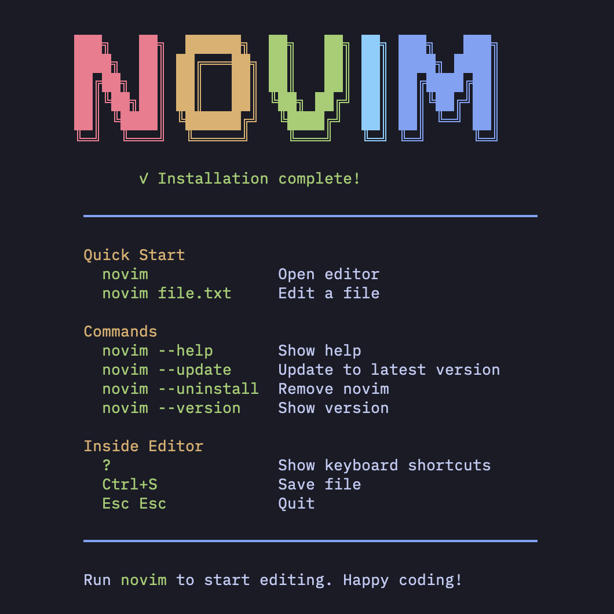
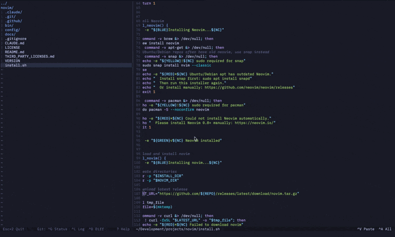

<p align="center">
  
</p>

<h1 align="center">novim</h1>

<p align="center">A friendly terminal editor for vibe coders. Not vim.</p>

<p align="center">
  <a href="https://novim.dev">
    
  </a>
  <a href="https://github.com/link2004/novim">
    
  </a>
  <a href="https://github.com/link2004/novim/blob/main/LICENSE">
    
  </a>
</p>

<p align="center">
  
</p>

> **Target audience**: Users who don't know Vim and want a VSCode-like editing experience in the terminal.

> **For Vim/Neovim users**: This is just a Neovim config. See [How it Works](#how-it-works) if you want to reference the config or cherry-pick ideas.

## Install

```bash
curl -fsSL novim.dev/install | bash
```

## Update

```bash
ow version
```

Press `?` for help inside the editor.

## Shortcuts

| Key | Action |
|-----|--------|
| Ctrl+S | Save |
| Ctrl+Z | Undo |
| Ctrl+Shift+Z | Redo |
| Ctrl+A | Select all |
| Ctrl+C | Copy (keeps selection) |
| Ctrl+V | Paste |
| Esc Esc | Quit (with save confirmation) |
| ? | Help |

Mac users: Cmd key also works (Cmd+S, Cmd+Z, etc.)

### Git Shortcuts

| Key | Action |
|-----|--------|
| Ctrl+G | Git status |
| Ctrl+L | Git log |
| Ctrl+D | Git diff |

## Features

- **VSCode-like experience** - Just type to edit, no modes to learn
- **Mouse support** - Click, drag, select, double-click to open, Ctrl+click to open externally
- **Standard shortcuts** - Ctrl+S, Ctrl+Z, Ctrl+C/V work as expected
- **File tree** - Built-in file browser on the left (1/3 of screen)
- **Dynamic hints** - Status bar shows relevant shortcuts for current context
- **Change highlighting** - Modified lines are highlighted until saved
- **Safe quit** - Prompts to save unsaved changes on exit
- **No vim knowledge required**

## Requirements

- Neovim 0.8+ (installed automatically if not found)
- macOS, Linux, or WSL

## How it Works

**novim is just a Neovim configuration file.** Nothing more.

```
novim/
├── bin/novim              # Bash script (sets XDG vars, runs nvim)
├── config/nvim/init.lua   # THE config file (~670 lines of Lua)
└── config/nvim/pack/...   # gitsigns.nvim plugin
```

The wrapper script just tells Neovim to use novim's config instead of yours:

```bash
export XDG_CONFIG_HOME="$NOVIM_CONFIG"
exec nvim "$@"
```

**That's literally it.** No special binary, no fork.

### For Neovim Users

If you already use Neovim:

```bash
# View the config
cat ~/.local/share/novim/config/nvim/init.lua

# Or on GitHub
# https://github.com/link2004/novim/blob/main/config/nvim/init.lua
```

Feel free to copy ideas or the entire config.

**[Read the full technical details →](docs/HOW_IT_WORKS.md)**

## Credits & Acknowledgments

novim is built on top of amazing open source projects:

### Core

- **[Neovim](https://neovim.io/)** - The hyperextensible Vim-based text editor
  License: Apache 2.0 / Vim License
  Copyright © Neovim contributors

### Plugins

- **[gitsigns.nvim](https://github.com/lewis6991/gitsigns.nvim)** - Git integration for buffers
  License: MIT
  Copyright © 2020 Lewis Russell

### Color Scheme

- **[Tokyo Night](https://github.com/tokyo-night/tokyo-night-vscode-theme)** - Color palette inspiration
  License: MIT
  Copyright © enkia

### Logo

- **[oh-my-logo](https://github.com/shinshin86/oh-my-logo)** - ASCII logo inspiration
  License: MIT / CC0-1.0

### Similar Projects

- **[novim-mode](https://github.com/tombh/novim-mode)** - A Vim plugin with similar goals (make Vim behave like a normal editor). novim is a separate project with a different approach (standalone wrapper vs plugin).

## License

MIT

See [THIRD_PARTY_LICENSES.md](THIRD_PARTY_LICENSES.md) for full license texts of dependencies.
